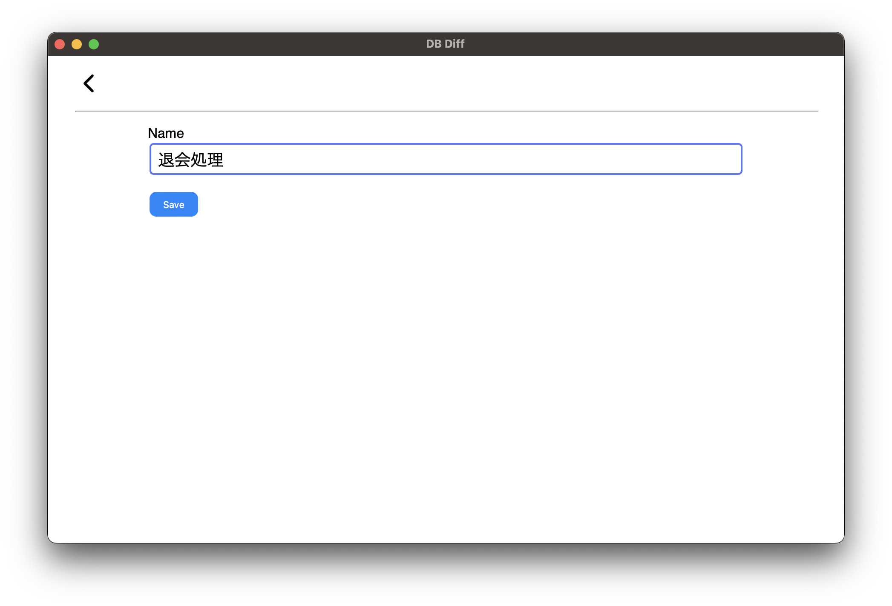
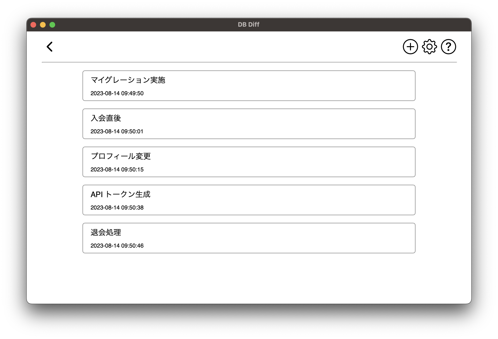
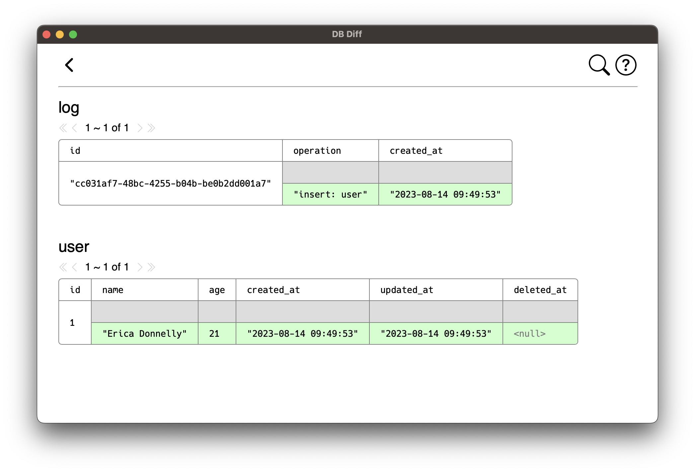
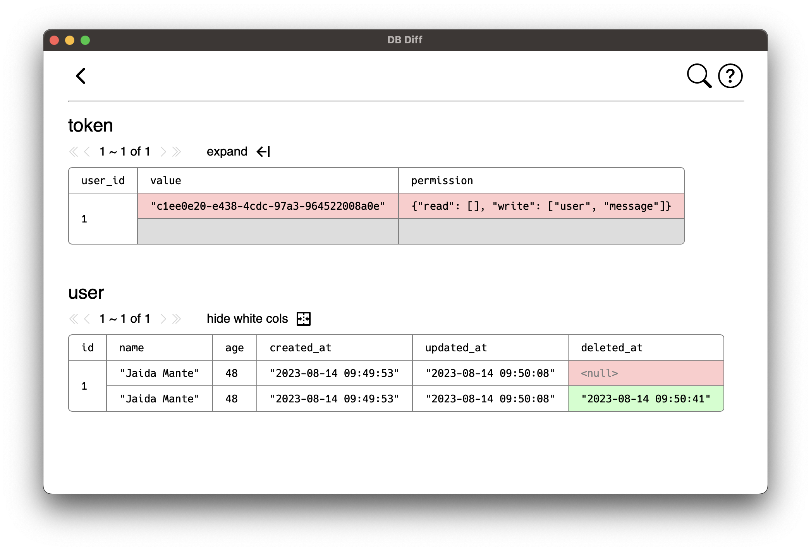
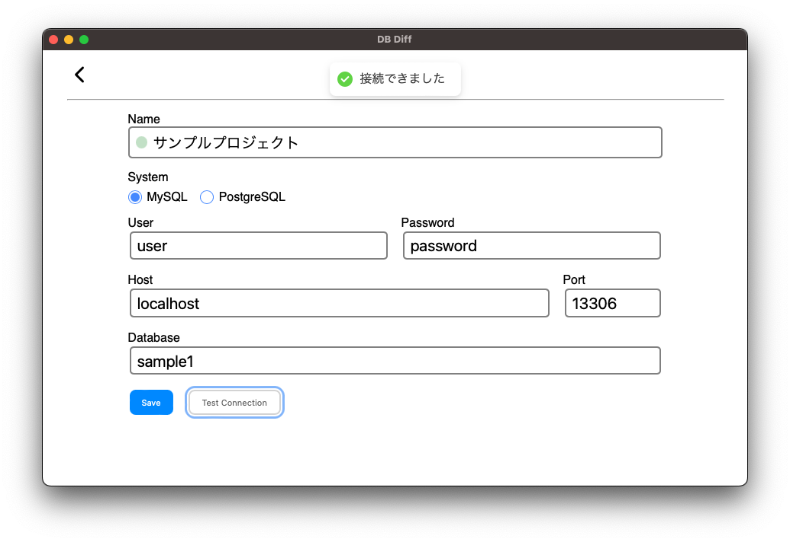
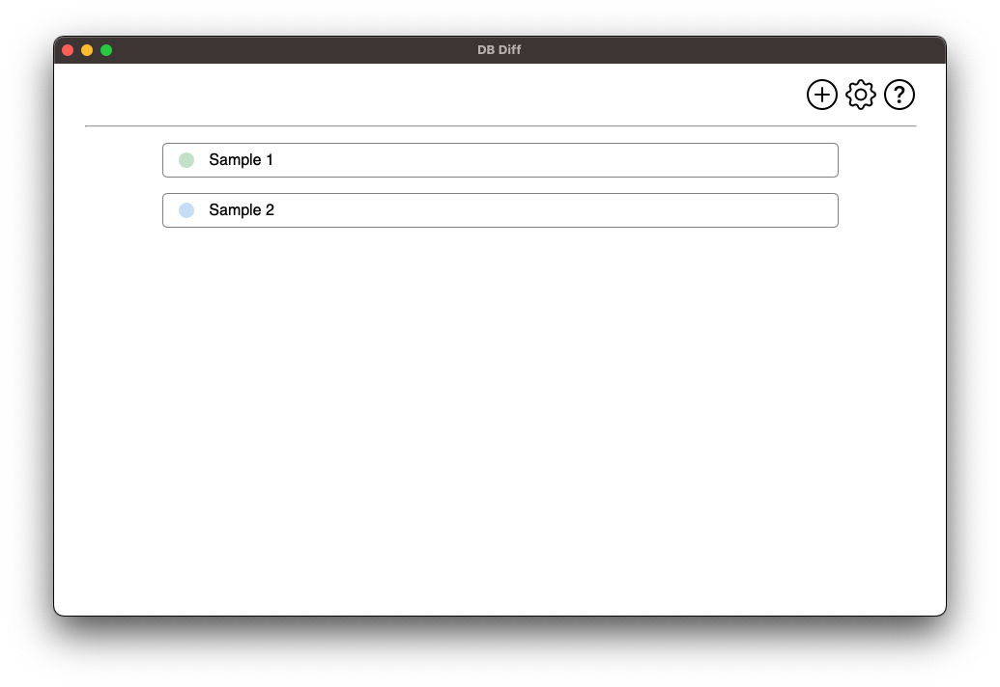

# DB Diff

データベースのテーブルを dump して保存し、2 つの dump データの差分を表示するアプリケーションです

## デモ

データベースの dump データを作成

比較する dump データを 2 つ選択

dump データの差分 ( マイグレーション実施 ~ 入会直後 )

dump データの差分 ( API トークン生成 ~ 退会処理 )

## 使い方

### ダウンロード

[Releases](https://github.com/suzuki-hoge/db-diff/releases) ページの Todo

Windows は ~

macOS は ~

Linux は ~

### データベースに接続

初回利用時に dump を実施するデータベースの接続情報を作成してください

作成した接続情報や dump 結果は DB Diff アプリ本体に内包される SQLite データベースに保存されます

### サンプル

初回起動時は 2 つの接続設定のサンプルが作成されています

このサンプルプロジェクトは [こちら](https://github.com/suzuki-hoge/db-diff-sample) で入手できます

## 仕様

### ネットワーク

現状接続できるデータベースは、DB Diff アプリを起動する PC が直接接続できるデータベースに限られます

ローカル開発環境や VPN や SSH の Local Port Forward を用いて接続できる開発環境における利用を想定しています

### 対応 RDBMS

- MySQL
  - 8.0
  - 5.7 ( 対応予定 / 動くかもしれないが動作保証外 )
  - 5.6 ( 対応予定 / 動くかもしれないが動作保証外 )
- PostgreSQL
  - 15 ( 対応予定 / 接続できません )
  - 14 ( 対応予定 / 接続できません )
  - 13 ( 対応予定 / 接続できません )
  - 12 ( 対応予定 / 接続できません )

### 差分表示

2 つの dump データを主キーでペアリングして差分計算を行います

主キーのないテーブルは解析対象外となります

主キーとみなすカラム構成については [こちら](./doc/primay-key.md) をご覧ください

### 大規模データについて

ローカル開発環境や非商用環境での開発補助を想定しています

数万程度のデータ量でも動きますが、それ以上巨大なデータベースに対する動作は保証しません

1 オンラインリクエストの差分を緻密に確認する用途を想定しています

( α ) 暫定ページネーションを改善しカクつかないくらいにはする予定

### バージョンについて

今後のメジャーバージョンアップによっては、過去に dump したデータは新しいバージョンでは使用できなくなる可能性があります
