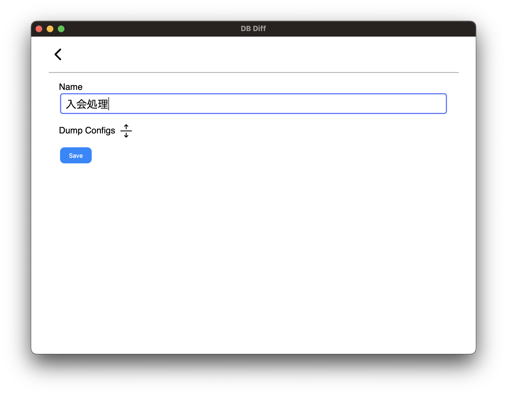
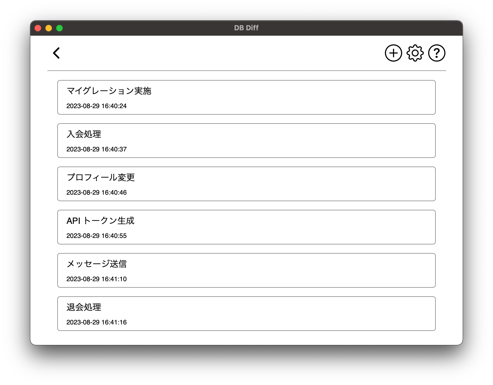
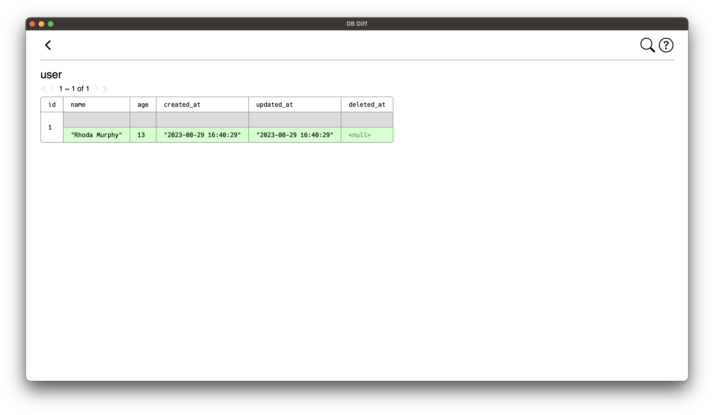
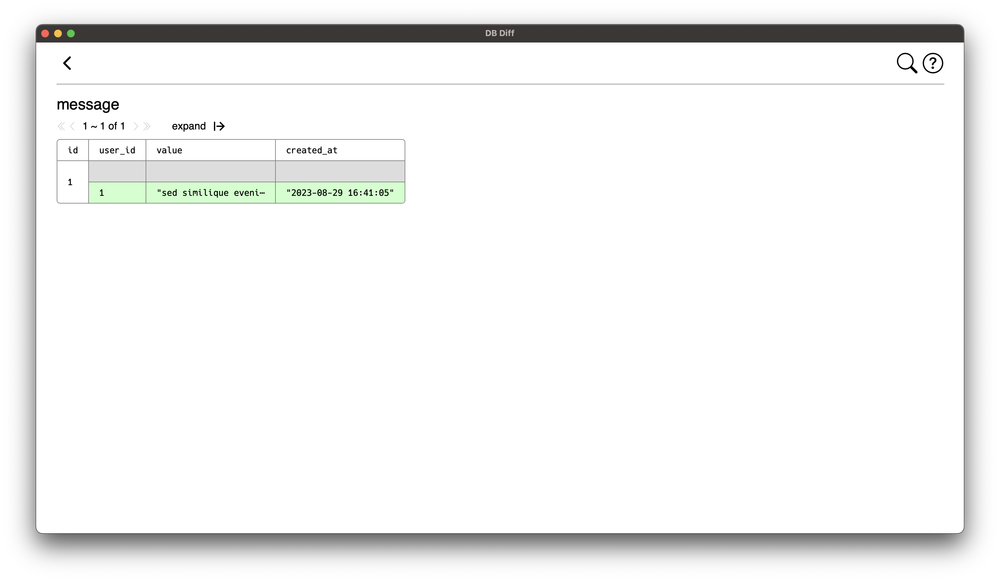
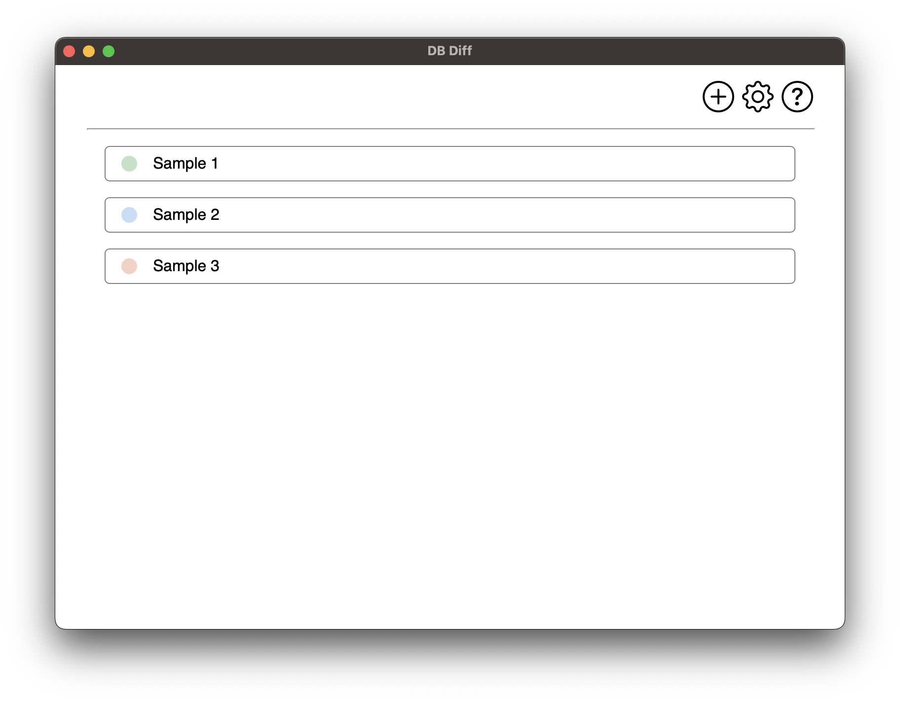

# DB Diff

データベースのテーブルを dump して保存し、2 つの dump データの差分を表示するアプリケーションです

## デモ

データベースの dump データを作成

比較する dump データを 2 つ選択

入会処理による差分を確認 ( マイグレーション実施 ~ 入会処理 )

メッセージ送信による差分を確認 ( API トークン生成 ~ メッセージ送信 )

退会処理による差分を確認 ( メッセージ送信 ~ 退会処理 )

## 使い方

### ダウンロード

[Releases](https://github.com/suzuki-hoge/db-diff/releases) ページから最新バージョンをダウンロードしてください

- Windows: `.msi`
- macOS: `*.app.tar.gz`
  - Intel 用ビルドですが ARM マシンでも Rosseta 2 で動作します
- Ubuntu: `*.deb`
- それ以外の Linux: `*.AppImage`

### データベースに接続

初回利用時に dump を実施するデータベースの接続情報を作成してください

作成した接続情報や dump 結果は SQLite データベースに保存されます  

( この SQLite データベースのセットアップは不要です )

### サンプル

初回起動時は３つの接続設定のサンプルが作成されています

このサンプルプロジェクトは [こちら](https://github.com/suzuki-hoge/db-diff-sample) で入手できます

### ワークスペース

起動時に `~/.db-diff` が作成され、SQLite データベースとログファイルが作成されます

## 仕様

### ネットワーク

現状接続できるデータベースは、DB Diff アプリを起動する PC が直接接続できるデータベースに限られます

ローカル開発環境や、VPN や SSH の Local Port Forward を用いて接続できる開発環境における利用を想定しています

### 対応 RDBMS

- MySQL
  - 8.0
  - 5.7 ( 対応予定 / 動くかもしれないが動作保証外 )
  - 5.6 ( 対応予定 / 動くかもしれないが動作保証外 )
- PostgreSQL
  - 15 ( 対応予定 / 接続できません )
  - 14 ( 対応予定 / 接続できません )
  - 13 ( 対応予定 / 接続できません )
  - 12 ( 対応予定 / 接続できません )

### 差分表示

2 つの dump データを主キーでペアリングして差分計算を行います

主キーのないテーブルは解析対象外となります

主キーとみなすカラム構成については [こちら](./doc/primay-key.md) をご覧ください

### 大規模データについて

ローカル開発環境や非商用環境での開発補助を想定しており、1 オンラインリクエストの差分を緻密に確認する用途を想定しています

dump データは 1 テーブルにつき 1,000 行までしか取得されません

必要に応じてテーブルごとに dump 設定を行って利用してください

#### Ordered 1,000

- 任意のカラムでソートして 1,000 行まで dump します
- `create` や `update` を含むカラム名がテーブルにあれば、デフォルト設定として使われます
  - `create` より `update` を含むカラム名が優先されます
  - 複数ヒットした場合は一番右のカラムが優先されます
- 可能な限りこれを指定してください
  - Auto Increment の ID なども指定できますが、若い ID に差分が出た場合に 1,000 行に含まれなくなるリスクがあります

#### Ignore

- dump 対象となりません
- 明らかに差分が発生しないテーブルや不要なテーブルに対して指定してください

#### Limited 1,000

- ソート条件なしで 1,000 行まで dump します
- 1,000 行に満たないことがわかっているテーブルをとりあえず dump するケースなどで指定してください

### バージョンについて

今後のメジャーバージョンアップによっては、過去に dump したデータは新しいバージョンでは使用できなくなる可能性があります
